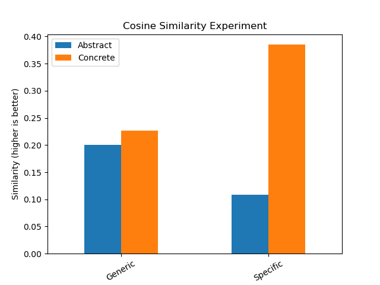

# Relazione del primo gruppo di esercizi

### TLN_dicaro_1.1 and TLN_dicaro_1.2

_CONSEGNA_:

* Date delle definizioni per quattro concetti (due concreti e due astratti),
calcolare la similarità fra di esse.
  

* Aggregare anche le definizioni secondo le dimensioni di concretezza e
specificità e ri-calcolare i punteggi.
  
  
* Effettuare del pre-processing se necessario prima del calcolo.
Analizzare i risultati.
  

_SVOLGIMENTO_:

**I termini sono**:
```
                    Generico    Specifico
                ==========================
    Concreto    |   Paper     Sharpener
    Astratto    |   Courage   Apprehension
```

* Si è scelto di filtrare le stopwords come fase di pre-processing, per
concentrarsi sui termini salienti.
  

* Si è notato come, nel caso di termini concreti, la similarità sia
significativamente più elevata di quanto non acccada per i termini astratti.
Questo è probabilmente dovuto alla possibilità di utilizzare degli attributi
visivi per descrivere il termine.


* Nel caso dei termini astratti, invece, la mancanza di questi attributi
concreti porta a definizioni meno simili fra di loro.
  

* Abbiamo provato, oltre la baseline, due diverse misure di similarità: Cosine sim and Pos.

_RISULTATI_:





### TLN_dicaro_1.3

_CONSEGNA_:


_SVOLGIMENTO_:

  
_RISULTATI_:


### TLN_dicaro_1.4

_CONSEGNA_:
* Implementare un sistema basato sulla teoria di Hanks per la costruzione del
significato.
  

* Scelto un verbo transitivo (quindi valenza >= 2), recuperare da un corpus
delle istanze in cui viene usato.
  

* Effettuare il parsing di queste frasi per identificare i supersensi di
WordNet associati agli argomenti del verbo (subject e object).
  

* Calcolare le frequenze di questi supersensi per i due ruoli e stampare le
possibili combinazioni.
  

_SVOLGIMENTO_:
* Si è scelto il verbo 'to break', in particolare il presente terza persona singolare.


* Il corpus utilizzato è Wikipedia, da cui sono state estratte 3000 frasi, usando 
  [sketch engine](https://www.sketchengine.eu/)


* Per il parsing a dipendenze si è usata la libreria [spaCy](https://spacy.io/).


* Sono state scartate quelle frasi in cui il verbo non presenta entrambi i ruoli richiesti.
  

* I termini che svolgono i ruoli vengono lemmatizzati e si va poi a calcolare
  il loro synset migliore tramite WSD (algoritmo di Lesk).


* Nel caso il soggetto sia 'he'/'she', è necessario forzare il suo synset a 'person.n.01' per evitare che
  venga erroneamente riconosciuto come 'elio', analogamente per 'it' sostituito ad 'artifact.n.01'


* Con questi synset si individua il relativo supersenso `lexname`, andando a calcolare
  poi frequenze e combinazioni possibili.


* Si creano poi due grafici con le migliori `k` coppie soggetto-oggetto, usando due versioni 
  differenti dell' algoritmo Lesk
  
_RISULTATI_:


## TLN_dicaro_1.5
_CONSEGNA_:
*  Esperimento content-to-form
   

*  Usando i dati dell’esercizio 1.1
   

*  Per ogni concetto, prendere le definizioni a disposizione,
   

*  Cercare in WordNet il synset corretto
   

*  Suggerimento: usate il principio del “genus” per indirizzare la ricerca

_SVOLGIMENTO_:

Lorem ipsums sit dolore ...........................................................

_RISULTATI_:

**COURAGE**

|n°  | Name: Courage, dtype: object|
| ------------- | ------------- |
| 0 |   [property, allows, face]
| 1 |    [ability, face, fears]
| 2 |     [ability, face, thing]
| 3 |   [inner, strength, thaht]
| 4 |   [ability, control, fear]

*The best word forms for concept are*

| Score | Synset |
| ------------- | ------------- |
 0.6666666666666666  |Synset('physical_ability.n.01') |
 0.5  |Synset('confront.v.04')|
 0.2857142857142857  |Synset('take_the_bull_by_the_horns.v.01')
 0.25  |Synset('lee.n.08')
 0  |Synset('countenance.n.03')|
```
max_sym is: 0.75
my wn synset inferred for courage is: Synset('physical_ability.n.01')
The best word forms for courage concept
Score: 0.6666666666666666 for synset: Synset('physical_ability.n.01')
Score: 0.5 for synset: Synset('confront.v.04')
Score: 0.2857142857142857 for synset: Synset('take_the_bull_by_the_horns.v.01')
Score: 0.25 for synset: Synset('lee.n.08')
Score: 0 for synset: Synset('countenance.n.03')
```

```
Computing concept paper
0          [cellulose, material, cut, folded, written]
1    [material, derived, trees, used, several, cont...
2                    [type, material, made, cellulose]
3        [product, obtained, wood, cellulose, ., used]
4          [flat, material, made, wood, used, writing]
Name: Paper, dtype: object
max_sym is: 0.6666666666666666
my wn synset inferred for paper is: Synset('coloring_material.n.01')
The best word forms for paper concept
Score: 0.5 for synset: Synset('coloring_material.n.01')
Score: 0.4444444444444444 for synset: Synset('animal_material.n.01')
Score: 0.4 for synset: Synset('aggregate.n.02')
Score: 0.3333333333333333 for synset: Synset('diethylaminoethyl_cellulose.n.01')
Score: 0.2857142857142857 for synset: Synset('carboxymethyl_cellulose.n.01')
Score: 0.25 for synset: Synset('carboxymethyl_cellulose.n.01')
Score: 0 for synset: Synset('carboxymethyl_cellulose.n.01')
```

```
 Computing concept apprehension
0    [something, strange, causes, strange, feeling,...
1                 [fearful, expectation, anticipation]
2                        [moode, one, feel, agitation]
3                                 [state, disturbance]
4                                      [worry, future]
Name: Apprehension, dtype: object
max_sym is: 1.0
my wn synset inferred for apprehension is: Synset('apprehension.n.01')
The best word forms for apprehension concept
Score: 0.8571428571428571 for synset: Synset('apprehension.n.01')
Score: 0.5714285714285714 for synset: Synset('expectation.n.03')
Score: 0.5 for synset: Synset('expectation.n.03')
Score: 0.4444444444444444 for synset: Synset('emotion.n.01')
Score: 0.4 for synset: Synset('astonishment.n.01')
Score: 0.3333333333333333 for synset: Synset('affection.n.01')
Score: 0.2857142857142857 for synset: Synset('affection.n.01')
Score: 0.25 for synset: Synset('affect.n.01')
Score: 0.2222222222222222 for synset: Synset('affect.n.01')
Score: 0.18181818181818182 for synset: Synset('affect.n.01')
Score: 0 for synset: Synset('affect.n.01')
```

```
 Computing concept sharpener
0    [tool, equipped, blade, allows, sharpen, tip]
1                   [object, used, shapen, pencil]
2                        [object, sharpen, pencil]
3                   [tool, used, sharpen, pencils]
4         [little, object, allow, sharpen, pencil]
Name: Sharpener, dtype: object
max_sym is: 0.7272727272727273
my wn synset inferred for sharpener is: Synset('acuminate.v.01')
The best word forms for sharpener concept
Score: 0.5454545454545454 for synset: Synset('acuminate.v.01')
Score: 0.5 for synset: Synset('drill.n.01')
Score: 0.4 for synset: Synset('cutting_implement.n.01')
Score: 0.2 for synset: Synset('abrader.n.01')
Score: 0.16666666666666666 for synset: Synset('abrader.n.01')
Score: 0 for synset: Synset('abrader.n.01')
```
