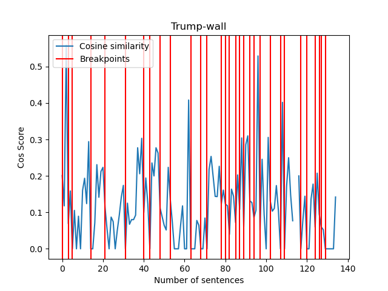

# Relazione del secondo gruppo di esercizi

### TLN_dicaro_2.1

_CONSEGNA_:

* Ispirandosi al text-tiling, implementare un algoritmo di segmentazione del
testo.

* Sfruttare informazioni come le frequenze e le co-occorrenze ed eventuale
pre-processing del testo.
  
_SVOLGIMENTO_:

* Breve lettura iniziale del seguente
  [articolo](https://www.sciencedirect.com/science/article/pii/S0031320316303399#bib12)

* Si è scelto di utilizzare un testo su Trump-wall già usato nella seconda
parte del corso come file d' ingresso

* Si crea per prima cosa il dizionario del testo, annotando le frequenze di
ogni parola (previo filtering e lemmatizzazione).

* Si creano poi i vettori che contengono i termini presenti in ogni frase.

* Si calcola la cosine similarity fra tutti questi vettori colonna.

* Si itera su queste cosine similarities per identificare i punti in cui il
valore scende al di sotto della loro media di una certa percentuale: in questi
punti viene inserito un punto di cambio di discorso.

* L' operazione viene ripetuta per un certo numero d' iterazioni, usando come
confronto la media di quel preciso segmento invece che la media complessiva.
  

_RISULTATI_:

- Notiamo un valore della cos sim molto altalenante, anche a causa di frasi dalla lunghezza altamente variabile

- Il discorso migliora se anziché lavorare sulle singole frasi, passiamo ai paragrafi. 
- Questo approccio è però meno generalizzabile poi dipende molto dalla formattazione del testo originale

Come confronto ulteriore si usa implementazione di nltk del TextTiling disponibile [qui](https://www.nltk.org/_modules/nltk/tokenize/texttiling.html)

- I due grafici non sono del tutto sovrapponibili per via di come gestiscono il file ingresso (in questo caso in maniera *raw*)

### TLN_dicaro_2.2

_CONSEGNA_:

- Topic modeling partendo da un corpus con visualizzazione

_SVOLGIMENTO e RISULTATI_:

- Come corpus abbiamo utilizzato il 20-Newsgroup dataset caricato come file .json. Questa versione contiene circa 11.000 
  newsgroups appartenenti a 20 diversi topics. Lo abbiamo importato come data frame la cui testa appare in questo modo:
  

- Abbiamo estratto i content e li abbiamo puliti, rimuovendo caratteri inutili in modo da renderli ottimali 
  per i metodi di pre-processing della libreria gensim.
- Tramite gensim (in particolare gensim.models.phrases) abbiamo generato bi-grammi e tri-grammi puliti da stop words.
- Abbiamo fatto la lemmatizzazione del testo considerando solo nomi, aggettivi, verbi e avverbi e, sempre grazie a librerie di gensim,
  abbiamo associato un id univoco a ogni parola del documento; abbiamo cioè creato un dizionario e poi un corpus per mappare id e frequenza specifica.
  
#### Latent Dirichlet Allocation

- Ottenuti dizionario e corpus, sempre usando gensim, abbiamo applicato il modello LDA ottenendo la suddivisione in topics. 
  Ogni topic risulta essere una combinazione di keywords che contribuiscono con un certo peso.
- Abbiamo cercato di dare un’interpretazione di senso ai topics usando **WordNet**;
- in particolare abbiamo ottenuto le otto parole più rappresentative per ogni topic e ne abbiamo estratto iponimi e iperonimi e per ogni topic abbiamo estratto 
  il synset più significativo sulla base delle occorrenze tra iponimi e iperonimi comuni. 
  
I risultati *non* sono stati però molto incoraggianti, rivelando una probabile incoerenza interna ai topic.
  

- Abbiamo calcolato perplexity (*quanto bene il modello rappresenta o riproduce le statistiche dei dati forniti*) 
  e coherence (*grado di similarità semantica tra le parole con alto score nel topic*) per dare una valutazione del modello
  
    | metric | score |
    | ------------- | ------------- |
    |Perplexity|  -8.57 |
    |Coherence |  0.41 ||

#### La bassa coerenza all’interno dei topics significa che probabilmente 20 topics sono troppi e sarebbe necessaria un’ottimizzazione.

- In questa prospettiva abbiamo, dunque, estratto i cinque lemmi più rappresentativi di ogni content; per la prima cinquina di content questo è il risultato:

- Ogni documento è composto da più argomenti. Ma in genere solo uno degli argomenti è dominante. 
- Abbiamo estratto questo argomento dominante per ogni content con il relativo peso e keywords; per il primi 10 contents questo è il risultato:

- Abbiamo poi ottenuto un grafico con la distribuzione dei topics all’interno del documento

- Abbiamo poi ottenuto la rappresentazione dei lemmi più significativi per ciascuno dei 20 topic; il risultato per i primi 10 topics è il seguente:

- Abbiamo infine ottenuto una word could per rappresentare le parole più rappresentative di ogni topic in diversi colori e grandezza a seconda della rilevanza:

